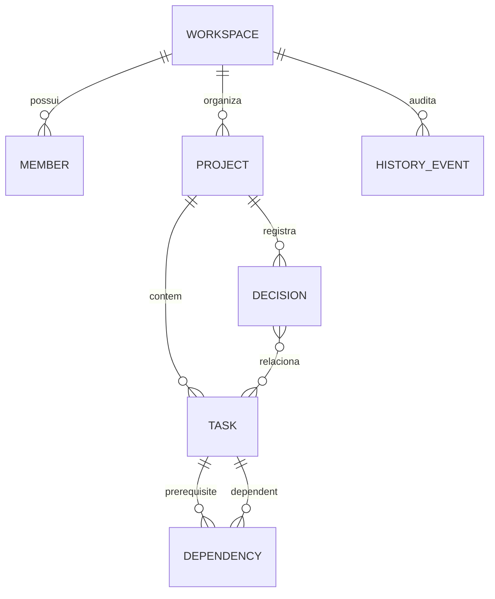

# Arquitetura — NexoGraph

## Decisão

MVP implementado como SPA estática em **ES modules + Web Platform APIs**, sem dependências de runtime externas.

- UI: HTML, CSS e JavaScript modular.
- Grafo: nós DOM posicionados + arestas SVG; pan, zoom e drag nativos.
- Persistência: IndexedDB, com fallback para localStorage.
- Domínio: módulo puro (`src/domain.mjs`) com regras de papéis, dependências, ciclos e conclusão.
- Testes: `node:test` + `assert`.
- Build: cópia determinística para `dist/`; nenhuma etapa de rede.

## Por que não Next.js no MVP

O requisito atual é uma aplicação web interativa, sem SEO, SSR, autenticação ou API remota obrigatória. A persistência solicitada pode ser atendida no dispositivo com IndexedDB. A opção sem framework reduz superfície de dependências, risco de supply chain e custo operacional, além de permitir publicação estática.

Uma versão colaborativa multiusuário deverá migrar o repositório para Next.js (ou outra camada full stack) e PostgreSQL/Supabase, mantendo `domain.mjs` como núcleo de regras.

## Modelo de dados

## Regras principais

- `viewer` é somente leitura; `editor` altera trabalho; `owner` também gerencia membros/papéis.
- Dependências são direcionadas de pré-requisito → tarefa dependente.
- Dependências cíclicas e auto-referentes são rejeitadas.
- Uma tarefa não pode ser concluída enquanto houver pré-requisito aberto.
- O projeto é concluído automaticamente quando todas as suas tarefas estão concluídas.
- Toda mutação relevante gera evento no histórico.

## Limites do MVP

- Persistência é local ao navegador/dispositivo; não há sincronização remota nem login.
- Dependências entre projetos diferentes não são permitidas.
- Alterações de posição dos nós são persistidas, mas não entram no histórico para evitar ruído.
